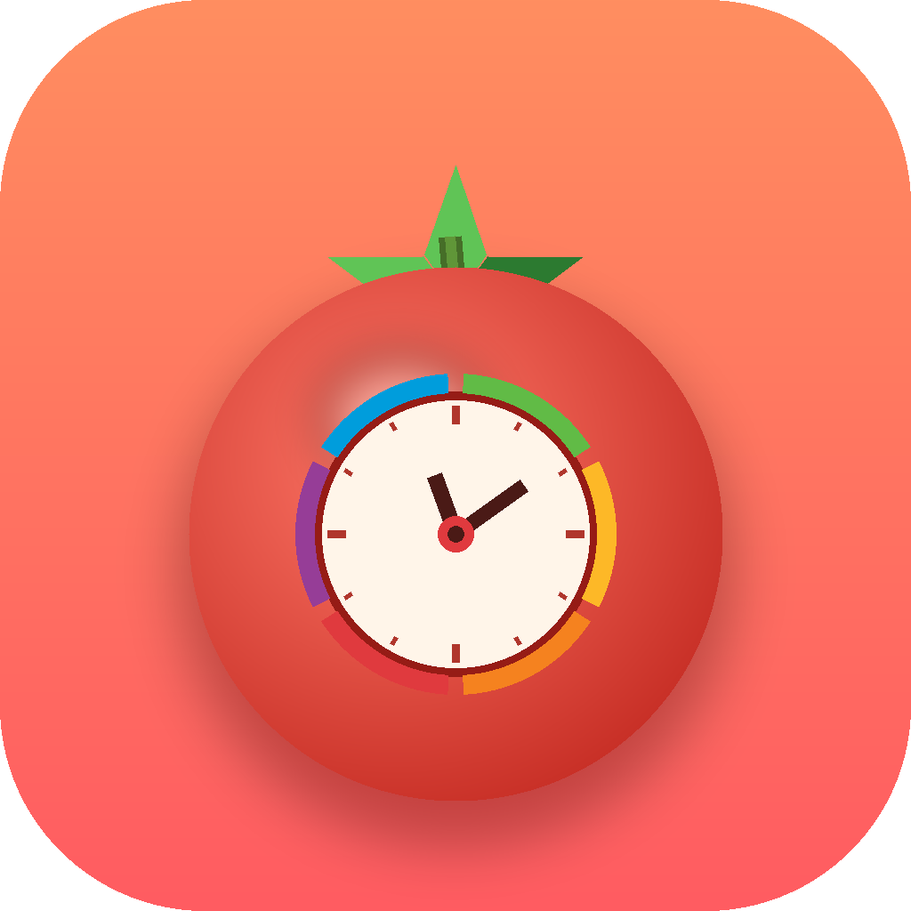

# Pomodoro Timer · 番茄钟

**English** · [简体中文](README.zh.md)

A terminal Pomodoro timer written in pure Bash, featuring a live clock, large ASCII countdown digits, a progress bar, and a WWDC countdown banner styled with the classic Apple rainbow logo colors. Ships with a macOS `.app` bundle and an icon.

> Developed with [Claude](https://claude.com/claude-code), Anthropic's AI assistant.



## Features

- **Live clock** + date display
- **Pomodoro technique**: focus / short break / long break cycle, fully automatic
- A **long break** kicks in after every **4 pomodoros**, with `●●●○` dots showing progress within the current set
- 5-row-tall **large ASCII countdown** digits, readable from across the room
- Colorful **progress bar** + percentage
- **Terminal bell + macOS notification** on each phase change
- **WWDC countdown** banner with letters in the six colors of the 1977 Apple rainbow logo
- Drawn entirely with ASCII / Unicode box characters — fits a standard terminal, no flicker or misalignment

## Usage

### Run the script directly

```bash
./pomodoro                 # defaults: focus 45 / short break 10 / long break 30 (minutes)
./pomodoro 25 5 15         # custom: focus 25 / short break 5 / long break 15
```

Press `Ctrl-C` to quit.

### As a macOS app

Double-click `番茄钟.app` — it opens a Terminal window running the timer. You can drag it into the Dock or the Applications folder.

> On first launch, if Gatekeeper blocks it (unsigned local app), right-click the icon → **Open** → click **Open** once more.

## Configuration

Editable at the top of the script:

```bash
FOCUS_MIN=45            # default focus length
BREAK_MIN=10            # short break length
LONGBREAK_MIN=30        # long break length
SET_SIZE=4              # number of pomodoros before a long break
WWDC_DATE="2026-06-08"  # WWDC date; remaining days are computed automatically
```

## Project structure

```
pomodoro            # the timer (Bash script / Unix executable)
番茄钟.app/          # macOS app bundle (double-click to launch)
icon/               # icon assets (png / svg / icns)
```

## Requirements

- macOS (notifications and the `.app` launcher rely on `osascript`; the core timing logic is portable Bash)
- A terminal with 256-color and Unicode support

## License

MIT
